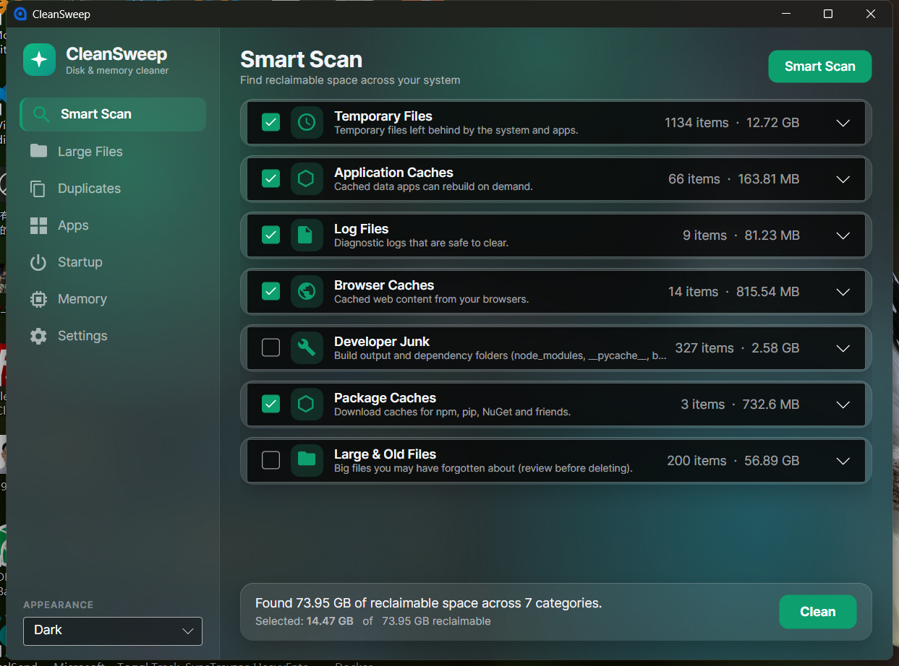
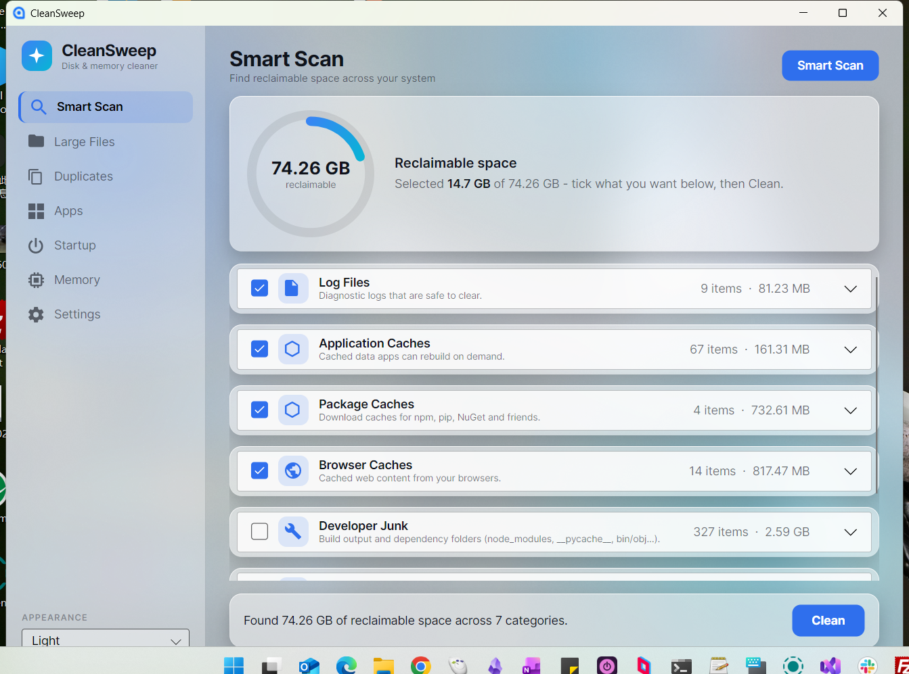
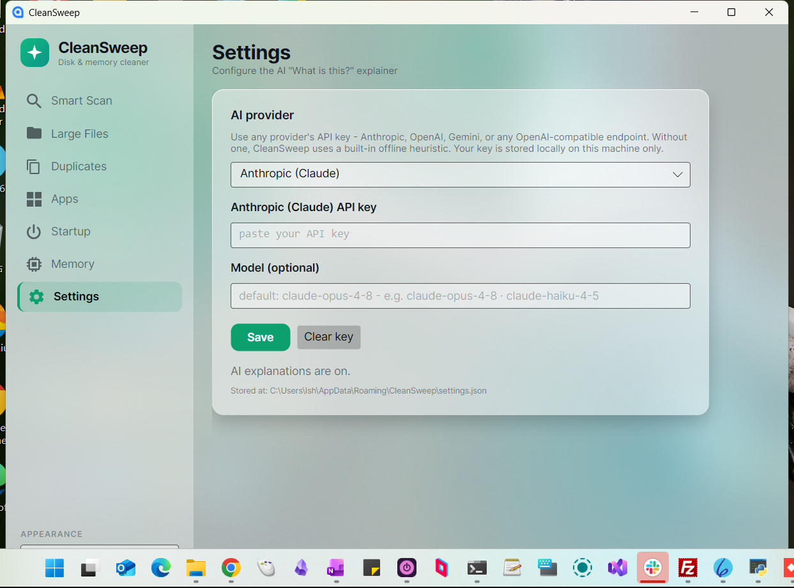

# CleanSweep

[](https://github.com/Leoreoreoreo/CleanSweep/actions/workflows/ci.yml)
[](https://github.com/Leoreoreoreo/CleanSweep/releases/latest)
[](https://dotnet.microsoft.com)
[](LICENSE)

A cross-platform disk and memory cleaner for Windows and macOS, built with .NET 10
and Avalonia. It finds reclaimable space, removes duplicates, manages installed apps
and startup items, and frees up RAM. An optional AI helper can explain any item
before you delete it.

The same codebase runs on Windows and macOS (and Linux); the correct OS
implementation is chosen at runtime.

<p align="center">
  
  
</p>

## Features

**Smart Scan** looks across several categories and lists each item with its size and a
checkbox:

| Category | What it finds |
|---|---|
| Temporary files | System and app temp directories |
| Application caches | Rebuildable cache data (`~/Library/Caches`, Windows caches) |
| Log files | Diagnostic logs that are safe to clear |
| Trash / Recycle Bin | Windows Recycle Bin (Shell API) or macOS `~/.Trash` |
| Browser caches | Chrome / Edge / Brave cache (Windows) |
| Developer junk | `node_modules`, `__pycache__`, `bin`/`obj`, `target`, `.gradle`, ... (opt-in) |
| Package caches | npm / pip / NuGet / Yarn download caches |
| Large files | Files of 100 MB or more under your dev roots and Downloads (opt-in) |

**Duplicate finder** groups byte-for-byte identical files. It compares by size first,
then a partial hash, then a full hash, so it only does the expensive work when it has
to. Keep one copy and remove the rest.

**App uninstaller** lists installed applications. On Windows it reads the uninstall
entries from the registry and runs the app's own uninstaller; on macOS it lists `.app`
bundles and moves the bundle plus its `~/Library` support files to the Trash.

**Startup manager** shows what runs at login and lets you turn items on or off. It
prefers disabling over deleting. On Windows it covers the Run keys, the Startup
folders, and Task Scheduler logon tasks; on macOS, LaunchAgents and login items.

**Free up RAM** trims process working sets on Windows or runs `purge` on macOS, with a
before/after memory gauge.

## AI explainer (optional)

If you're unsure about an item, click the question mark next to it for a short
explanation, a risk rating (safe / caution / risky), and a recommendation.

It works with any provider. Open Settings and choose one:

- Anthropic (Claude), through the official SDK
- OpenAI
- Google Gemini
- Custom: any OpenAI-compatible endpoint (Groq, OpenRouter, DeepSeek, a local server)
  by entering its base URL

Paste an API key and, optionally, a model name. Settings are stored locally under your
user profile and take effect right away. You can also set `ANTHROPIC_API_KEY` or
`OPENAI_API_KEY` in the environment. With no key, the app falls back to a small offline
heuristic for common items, so it never blocks the UI or fails.



The interface has a translucent theme with a light / dark / system toggle.

## Running

```
dotnet run --project src/CleanSweep
```

## Standalone builds

Self-contained, single-file builds that run without a .NET install:

```
# Windows  -> publish/win-x64/CleanSweep.exe
./scripts/publish-windows.ps1

# macOS (Apple Silicon)  -> publish/CleanSweep.app
./scripts/publish-macos.sh
```

Or call the SDK directly:

```
dotnet publish src/CleanSweep -c Release -r win-x64   --self-contained -p:PublishSingleFile=true
dotnet publish src/CleanSweep -c Release -r osx-arm64 --self-contained -p:PublishSingleFile=true
```

## Tests

```
dotnet test
```

The test project covers the engine's safety-critical paths: the delete guard,
duplicate grouping, the scan modules, and the AI offline fallback. Everything runs
against temporary directories with a fake platform-paths implementation, so the tests
are deterministic and never touch real system paths or the network.

## Project layout

```
src/CleanSweep.Core   Engine with no UI dependencies: platform paths, scan modules,
                      duplicate finder, app inventory, startup manager, memory, and
                      the SafeDeleter delete guard.
src/CleanSweep.AI     AI explainer (Anthropic SDK plus an OpenAI-compatible HTTP path).
src/CleanSweep        Avalonia UI (MVVM, CommunityToolkit.Mvvm).
tests/                xUnit tests for the engine.
scripts/              Publish scripts.
```

Each OS-specific capability sits behind a small interface in the core
(`IPlatformPaths`, `IDuplicateFinder`, `IAppInventory`, `IStartupManager`,
`IItemExplainer`) with separate Windows and macOS implementations. Adding a scan target
is usually a matter of implementing `ICleanupModule` and registering it in `ScanEngine`.

## Safety

- `SafeDeleter` refuses to delete any path that is, or contains, a protected location:
  OS directories, drive roots, your home folder, Documents/Desktop/Pictures, iCloud,
  and keychains. Every delete goes through it.
- Risky or irreversible actions (developer junk, large files, duplicates, uninstalling
  an app, removing a login item) are never selected by default and ask for confirmation.
- File access is guarded throughout. Locked or permission-denied items are skipped
  rather than aborting a scan.

## License

MIT. See [LICENSE](LICENSE).
